Visual Examples
===============

This page shows some visual examples of the included blending modes.

All examples are blends of two images: As a bottom layer, there is a rainbow-filled square with
some transparent border on the right and bottom edges. The top layer is a small rectangle that is
filled with a colorful circular gradient. The top layer is blended upon the bottom layer with 50%
transparency in all of the examples below.

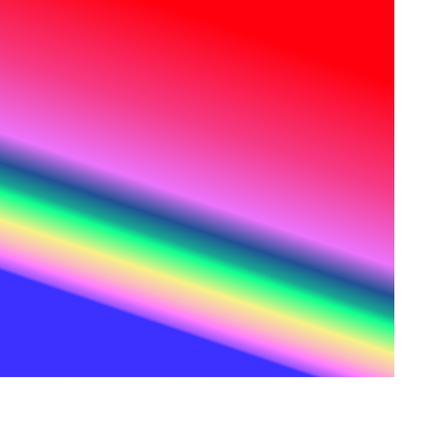

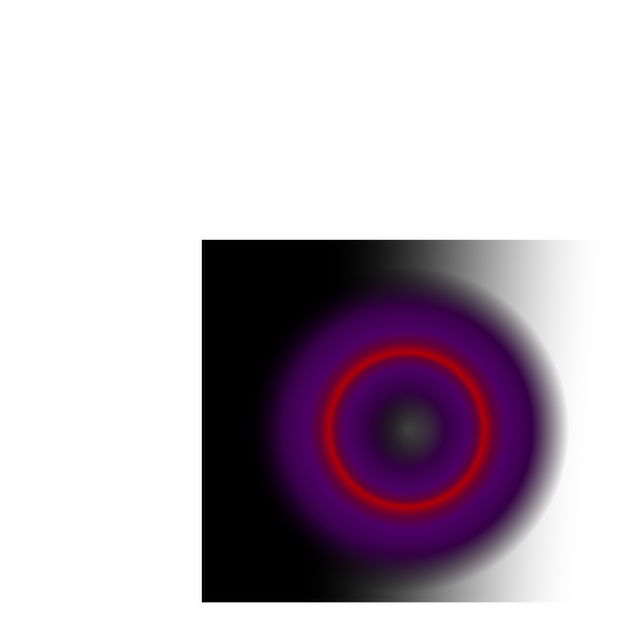

.. table:: Bottom and top layers for blending examples
   :align: center

   +---------+---------+
   | |logo1| | |logo2| |
   +---------+---------+

Addition
--------

Darken Only
-----------
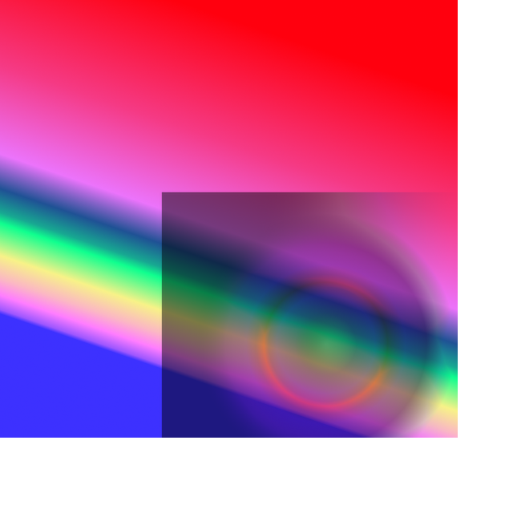

Difference
----------
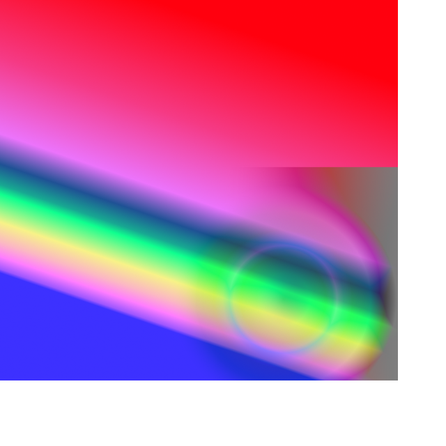

Divide
------
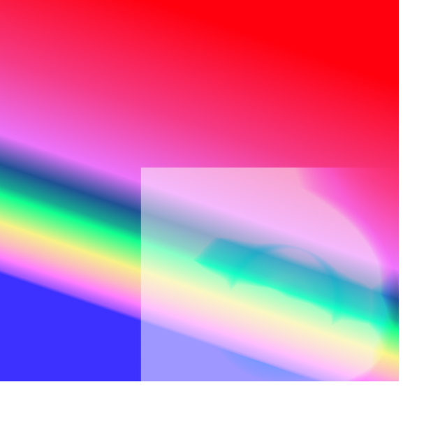

Dodge
-----
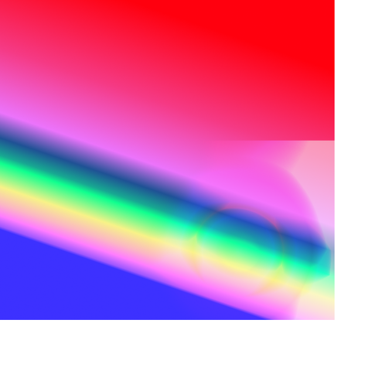

Grain Extract
-------------
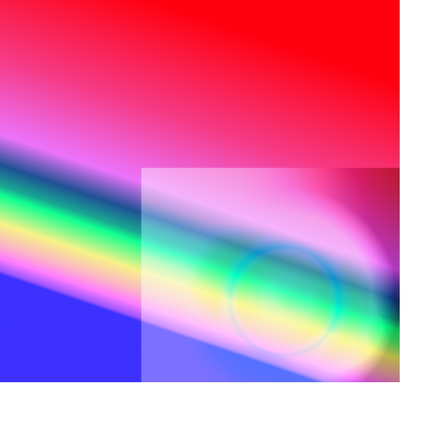

Grain Merge
-----------
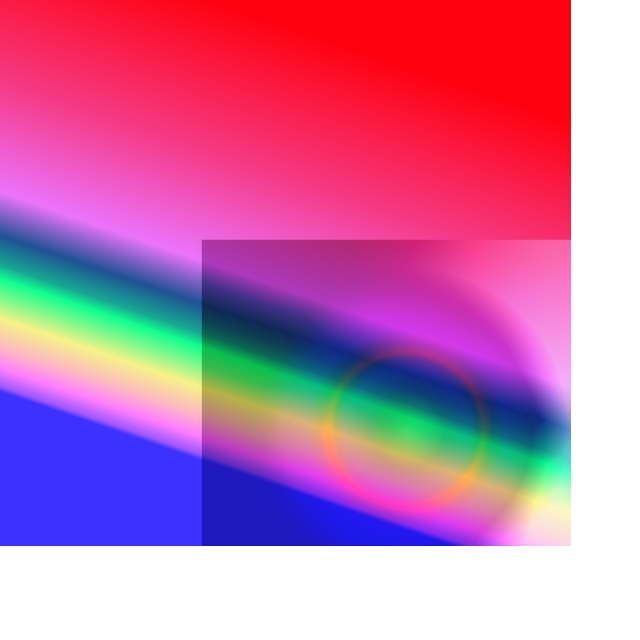

Hard Light
----------
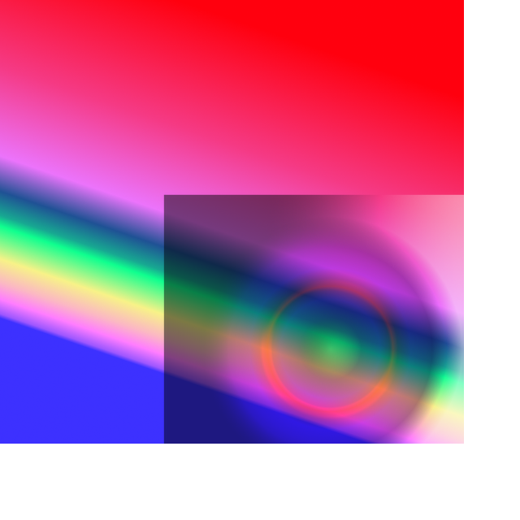

Lighten Only
------------
.. image:: ../tests/lighten_only.png
    :width: 30%

Multiply
--------
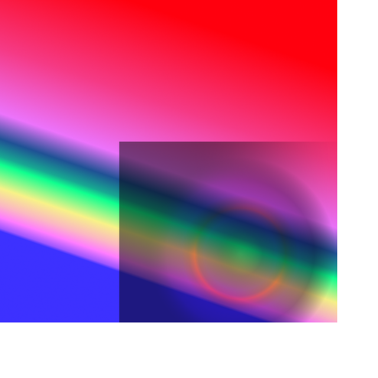

Normal
------
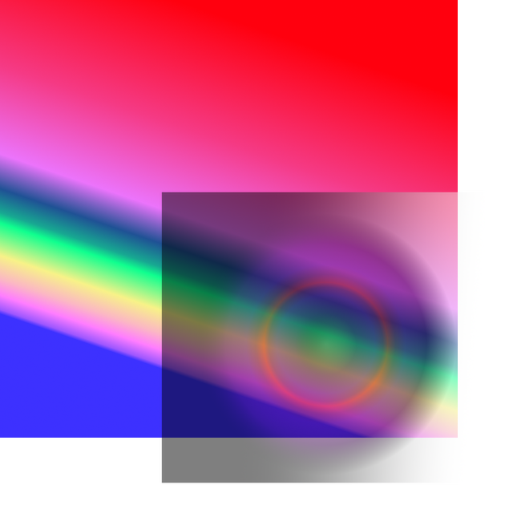

Overlay
-------
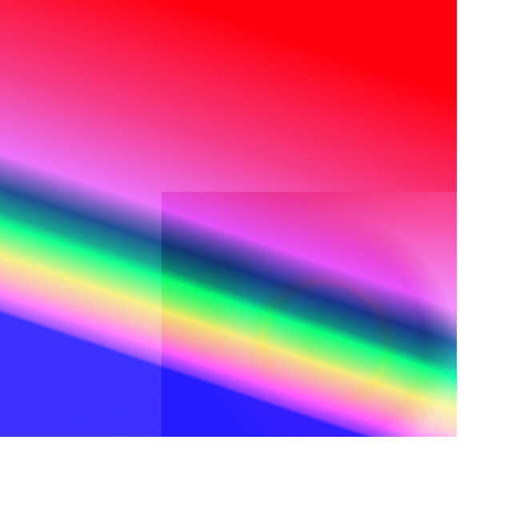

Screen
------
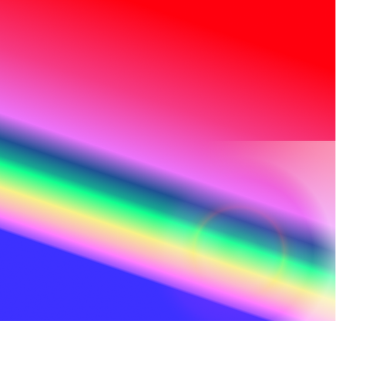

Soft Light
-----------
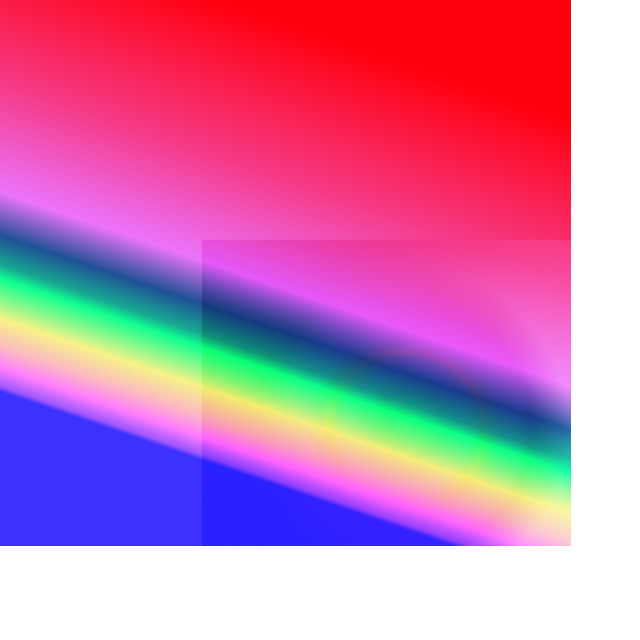

Subtract
--------
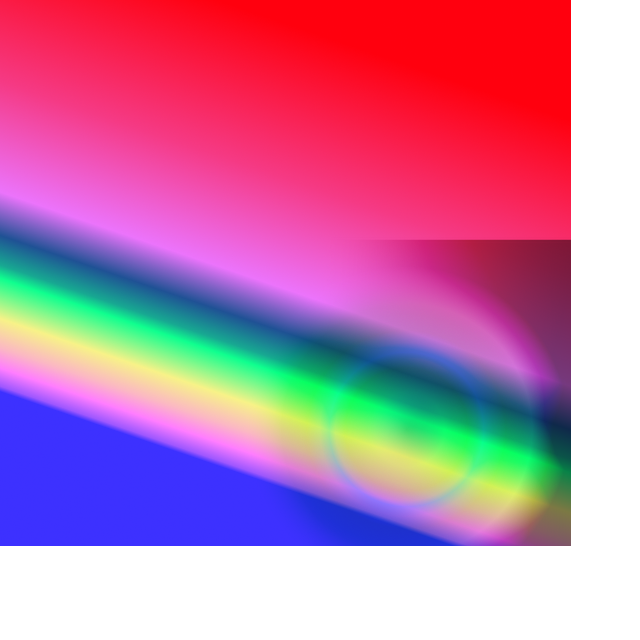