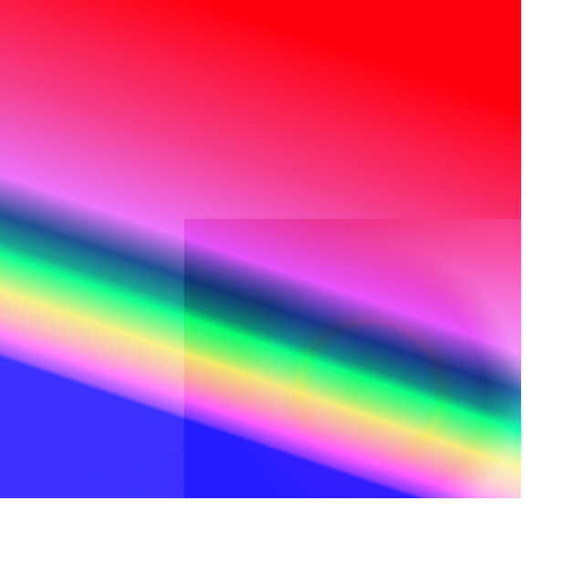

Visual Reference
================

This page serves as a visual reference for the blend modes available in this Python package.
Click on the title on top of an image to get to the documentation of the related blending function.

Panel of Examples
-----------------

.. |addition| image:: ../tests/addition.png
    :scale: 30%

.. |darken_only| image:: ../tests/darken_only.png
    :scale: 30%

.. |difference| image:: ../tests/difference.png
    :scale: 30%

.. |divide| image:: ../tests/divide.png
    :scale: 30%

.. |dodge| image:: ../tests/dodge.png
    :scale: 30%

.. |grain_extract| image:: ../tests/grain_extract.png
    :scale: 30%

.. |grain_merge| image:: ../tests/grain_merge.png
    :scale: 30%

.. |hard_light| image:: ../tests/hard_light.png
    :scale: 30%

.. |lighten_only| image:: ../tests/lighten_only.png
    :scale: 30%

.. |multiply| image:: ../tests/multiply.png
    :scale: 30%

.. |normal_50p| image:: ../tests/normal_50p.png
    :scale: 30%

.. |overlay| image:: ../tests/overlay.png
    :scale: 30%

.. |screen| image:: ../tests/screen.png
    :scale: 30%

.. |subtract| image:: ../tests/subtract.png
    :scale: 30%

.. table::
    :align: center

    +--------------------------------------------------------------------+--------------------------------------------------------------------+------------------------------------------------------------------------+
    |    :func:`addition() <blend_modes.blending_functions.addition>`    | :func:`darken_only() <blend_modes.blending_functions.darken_only>` |    :func:`difference() <blend_modes.blending_functions.difference>`    |
    |                             |addition|                             |                            |darken_only|                           |                              |difference|                              |
    +--------------------------------------------------------------------+--------------------------------------------------------------------+------------------------------------------------------------------------+
    |      :func:`divide() <blend_modes.blending_functions.divide>`      |       :func:`dodge() <blend_modes.blending_functions.dodge>`       | :func:`grain_extract() <blend_modes.blending_functions.grain_extract>` |
    |                              |divide|                              |                               |dodge|                              |                             |grain_extract|                            |
    +--------------------------------------------------------------------+--------------------------------------------------------------------+------------------------------------------------------------------------+
    | :func:`grain_merge() <blend_modes.blending_functions.grain_merge>` |  :func:`hard_light() <blend_modes.blending_functions.hard_light>`  |  :func:`lighten_only() <blend_modes.blending_functions.lighten_only>`  |
    |                            |grain_merge|                           |                            |hard_light|                            |                             |lighten_only|                             |
    +--------------------------------------------------------------------+--------------------------------------------------------------------+------------------------------------------------------------------------+
    |    :func:`multiply() <blend_modes.blending_functions.multiply>`    |      :func:`normal() <blend_modes.blending_functions.normal>`      |       :func:`overlay() <blend_modes.blending_functions.overlay>`       |
    |                             |multiply|                             |                            |normal_50p|                            |                                |overlay|                               |
    +--------------------------------------------------------------------+--------------------------------------------------------------------+------------------------------------------------------------------------+
    |      :func:`screen() <blend_modes.blending_functions.screen>`      |  :func:`soft_light() <blend_modes.blending_functions.soft_light>`  |      :func:`subtract() <blend_modes.blending_functions.subtract>`      |
    |                              |screen|                              |                            |soft_light|                            |                               |subtract|                               |
    +--------------------------------------------------------------------+--------------------------------------------------------------------+------------------------------------------------------------------------+

About the Blended Images
------------------------

All examples are blends of two images: As a bottom layer, there is a rainbow-filled square with
some transparent border on the right and bottom edges. The top layer is a small rectangle that is
filled with a colorful circular gradient. The top layer is blended upon the bottom layer with 50%
transparency in all of the images in the Panel of Examples above.

    .. |logo1| image:: ../tests/orig.png
        :scale: 30%

    .. |logo2| image:: ../tests/layer.png
        :scale: 30%

    .. table:: Bottom and top layers for blending examples
       :align: center

       +---------+---------+
       | |logo1| | |logo2| |
       +---------+---------+